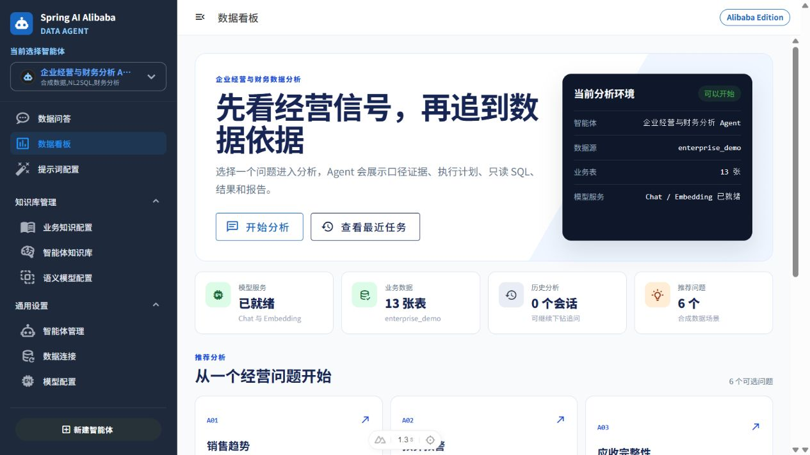
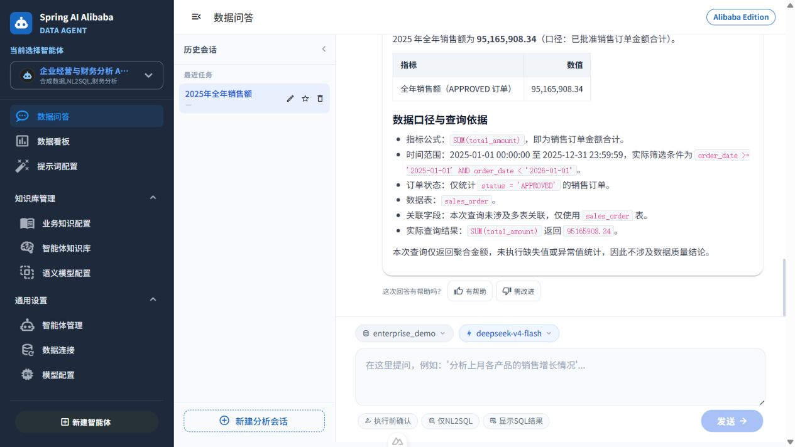
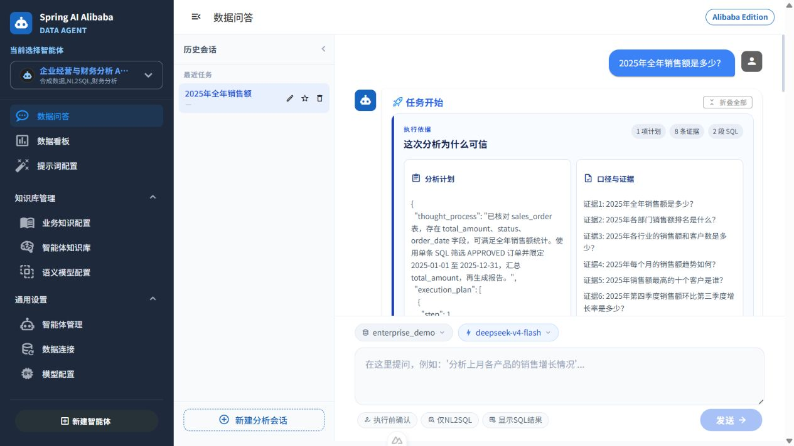

# 企业经营与财务数据分析 Agent

基于 [Spring AI Alibaba DataAgent](https://github.com/spring-ai-alibaba/DataAgent) 二次开发的个人开源项目。项目只使用固定种子生成的合成经营、财务和 KPI 数据，用于展示 RAG 业务语义增强、NL2SQL、多轮下钻、只读 SQL 安全、审计和可重复评测。

> 本项目不是从零开发的 DataAgent，也没有接入任何任职公司系统或真实企业数据。仓库中的金额、客户、员工、合同、指标和评测结果均来自合成演示环境，不代表生产成果。

## 已验证结果

| 能力 | 当前证据 |
|---|---|
| 合成数据 | 固定种子 `20260824`，24 个月、20,000 笔订单，A01-A06 异常可重复验证 |
| 语义知识 | 63 个字段语义、14 条业务知识、18 组标准问答、5 组真实向量召回通过 |
| 查询闭环 | 20/20 核心问题、3/3 多轮下钻、4/4 意图识别通过 |
| SQL 安全 | 单条 `SELECT`、AST 校验、表字段白名单、500 行上限、15 秒超时、部门范围、脱敏和审计 |
| M6 评测 | SQL 可执行率 94.44%，结果正确率 94.44%，指标口径正确率 87.50%，12/12 危险请求拦截 |
| 自动化回归 | 后端 1732/1732、Python 分阶段测试 17/17、前端 30/30 通过 |

评测分母、失败明细和适用边界见 [M6 最终评测报告](demo/enterprise-finance/m6/evidence/final-accepted.md) 与 [已知限制](docs/已知限制.md)。

## 核心流程

```text
自然语言问题
→ 意图识别与多轮上下文
→ 指标口径、业务知识和 Schema 召回
→ 分析计划与可选人工确认
→ SQL 生成与语义一致性检查
→ SQL AST / 表字段 / 数据范围安全校验
→ 只读 MySQL 查询
→ 结果表格、图表、报告与审计
```

技术基线：Java 17、Spring Boot 3.4.8、Spring AI 1.1.2、Spring AI Alibaba 1.1.2.2、MySQL 8.4、Nuxt 4、Vue 3、TypeScript、Pinia、Vuetify 和 Docker Compose。

## Docker Compose 快速启动

前置条件：Docker Engine 与 Docker Compose 可用；首次构建需要访问 Maven、npm 和 Docker 镜像仓库。

### 1. 获取项目

```bash
git clone https://github.com/ayer2/enterprise-finance-agent.git
cd enterprise-finance-agent
```

### 2. 准备环境变量

```bash
cp .env.example .env
notepad .env
```

必须替换两个 `CHANGE_ME`。`.env` 已被 Git 忽略，不要把其中的密码或模型密钥提交到仓库。

| 变量 | 用途 | 默认值或要求 |
|---|---|---|
| `M7_MYSQL_ROOT_PASSWORD` | Compose 管理库初始化密码 | 必须修改 |
| `ENTERPRISE_DEMO_READONLY_PASSWORD` | Agent 查询合成业务库的只读账号密码 | 必须修改 |
| `M7_FRONTEND_PORT` | 前端映射端口 | `3000` |
| `M7_BACKEND_PORT` | 后端映射端口 | `8065` |
| `M7_MYSQL_PORT` | MySQL 映射端口 | `3307` |

### 3. 构建并启动

```bash
docker compose up --build -d
docker compose ps
./deploy/verify.sh
```

首次后端镜像构建需要下载较多上游依赖，耗时可能达到十几分钟；后续构建会复用缓存。三个服务显示 `healthy`，且验证脚本输出 `M7_DEPLOYMENT_VERIFICATION_PASSED`，表示部署层验收通过。

验证通过后访问：

- 前端：`http://localhost:3000`
- 后端：`http://localhost:8065`
- 合成业务库：`localhost:3307/enterprise_demo`

Compose 会自动完成以下工作：

- 从生成器构建固定种子业务数据，不依赖仓库中的大体积生成文件。
- 初始化并持久化 `saa_data_agent` 管理库与 `enterprise_demo` 合成业务库。
- 创建仅有 `enterprise_demo.* SELECT` 权限的 `enterprise_agent_ro` 账号。
- 构建并启动 Spring Boot 后端、Nuxt 静态前端和 Nginx SSE 反向代理。

### Sub2 专用部署（不创建演示业务库）

如果只需要在服务器上查询 Sub2 中转站数据，可以使用仓库中的 `compose.sub2.yaml`。它只创建 DataAgent 自己的管理库，不执行 `enterprise_demo` 的生成脚本；Sub2 仍由官方镜像独立维护，并通过 PostgreSQL/MySQL 只读数据源接入。

```bash
cp .env.sub2.example .env.sub2
# 编辑 .env.sub2，替换 CHANGE_ME
export SUB2_UPSTREAM_NETWORK="$(docker inspect -f '{{range $name, $network := .NetworkSettings.Networks}}{{$name}}{{end}}' sub2api-postgres)"
docker compose --env-file .env.sub2 -f compose.sub2.yaml up -d --build
```

启动后访问 `http://服务器地址:3001`，创建 Sub2 Agent 并绑定 Sub2 数据库。字段白名单和安全注意事项见 [Sub2 接入部署](docs/SUB2接入部署.md)。

### 4. 配置模型与 Agent

模型密钥不会从 `.env` 注入，也不会保存在 Git 中。首次启动后仍需在页面完成一次本地配置：

1. 在“模型配置”中新增 Chat 与 Embedding 模型；填写供应商、模型名称、Base URL 和本地 API Key，连接测试通过后分别激活。OpenAI 兼容标准接口的 Path 通常留空；若供应商提供独立路径，以供应商文档为准。
2. 创建“企业经营与财务数据分析 Agent”。
3. 添加 MySQL 数据源：主机 `database`、端口 `3306`、数据库 `enterprise_demo`、用户 `enterprise_agent_ro`，密码取本机 `.env` 的 `ENTERPRISE_DEMO_READONLY_PASSWORD`。
4. 选择 13 张业务表并初始化数据源。
5. 导入并向量化版本化知识：

```bash
python ./demo/enterprise-finance/knowledge/import_knowledge.py --agent-id <agent-id>
python ./demo/enterprise-finance/knowledge/verify_recall.py --agent-id <agent-id>
```

6. 发布 Agent，在经营分析首页执行演示问题。

模型、Agent、数据源和知识配置保存在 Compose 的 MySQL 数据卷中；普通重启或执行 `docker compose down` 不会丢失。全新 Docker 部署不会继承开发模式 H2 内存库中的模型配置。

### 5. 日常操作

停止服务但保留数据：

```bash
docker compose down
```

删除 Compose 数据卷会清空本地管理配置和演示数据库，只有明确需要从头重建时才执行：

```bash
docker compose down --volumes
```

## 推荐演示

1. `2025年全年销售额是多少？`
2. `请按月拆分这笔全年销售额，并列出每月金额。`
3. `哪些销售订单没有生成应收单？`
4. `哪些部门在2025年第三和第四季度连续有KPI未达标？`
5. 打开执行依据，查看计划、召回证据、只读 SQL 和结果。
6. 下载 Markdown/HTML 报告并从最近任务恢复会话。

3–5 分钟讲解节奏见 [演示脚本](docs/演示脚本.md)。

### 真实页面与演示视频

以下内容来自本地真实模型问答，页面未包含 API Key 或个人信息。







[观看 3 分钟无声引导演示](docs/assets/demo/enterprise-finance-agent-demo.mp4)；配套字幕文件为 [demo-captions.srt](docs/assets/demo/demo-captions.srt)。

## 文档与证据

| 文档 | 内容 |
|---|---|
| [架构与安全设计](docs/作品架构与安全设计.md) | 部署架构、ER 图、核心时序和纵深防御 |
| [合成数据设计](docs/模拟业务数据设计.md) | 数据边界、关系、指标口径和异常注入 |
| [M6 自动评测记录](docs/M6自动评测验证记录.md) | 题集、指标定义、失败路径和验收命令 |
| [M6 可读报告](demo/enterprise-finance/m6/evidence/final-accepted.md) | 最终实际指标与失败明细 |
| [已知限制](docs/已知限制.md) | 当前不支持范围与公开演示注意事项 |
| [M7 验证记录](docs/M7部署与作品包装验证记录.md) | 镜像构建、启动、截图、视频和发布前检查 |
| [上游架构](docs/ARCHITECTURE.md) | DataAgent 原有整体架构和高级能力 |

## 项目来源与个人改造

- 上游：Spring AI Alibaba DataAgent，基线提交 `3fb7852`。
- 沿用上游：StateGraph 工作流、模型配置、语义知识管理、SSE 聊天页面及基础管理能力。
- 本项目新增：固定种子企业经营数据、指标知识与标准问答、查询闭环证据、SQL 纵深安全与审计、经营分析首页、执行依据与反馈、M6 自动评测、Docker Compose 交付和公开演示材料。
- 数据来源：全部由 `demo/enterprise-finance/generator/generate.py` 生成；名称、编号、金额和业务关系不对应任何真实企业或个人。

## 安全边界

Compose 面向本地演示，不是互联网生产部署模板。默认不提供 HTTPS、统一身份认证、API 限流、密钥托管、高可用和备份策略；外部 API Key 校验也不是当前完整安全边界。公开部署前必须补齐这些能力，并限制管理端和数据库端口的网络访问。

Python 沙盒不在默认 Compose 中挂载 Docker Socket，因为 SQL-only MVP 不需要它；如需启用，应单独评估宿主机 Docker 权限、镜像 digest、包源和出网策略。

## License

本项目沿用上游 [Apache License 2.0](LICENSE)。二次开发说明不改变上游作者和许可证声明。
