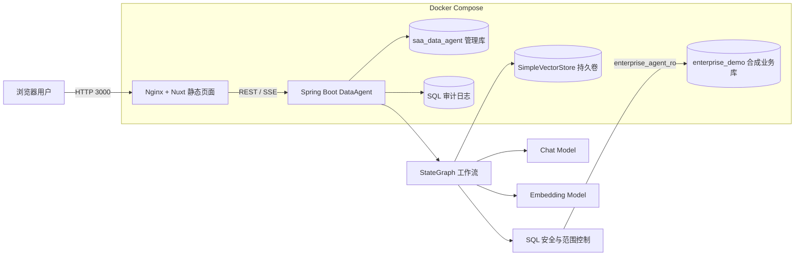
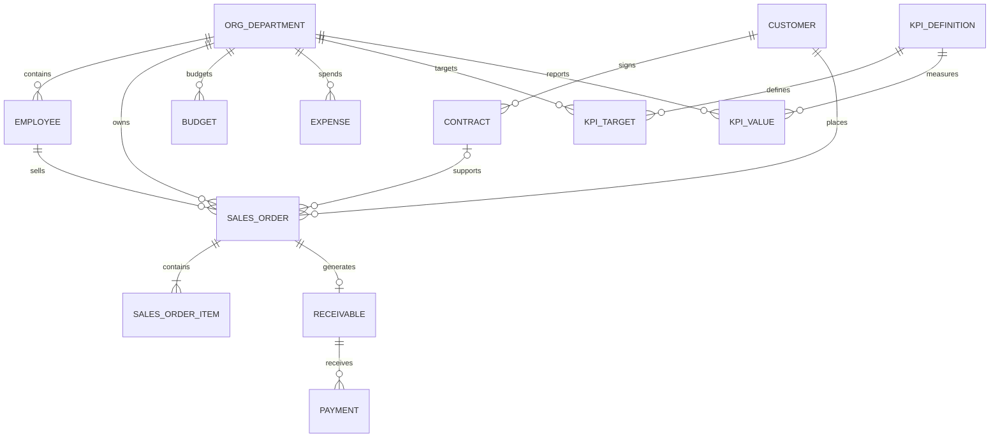
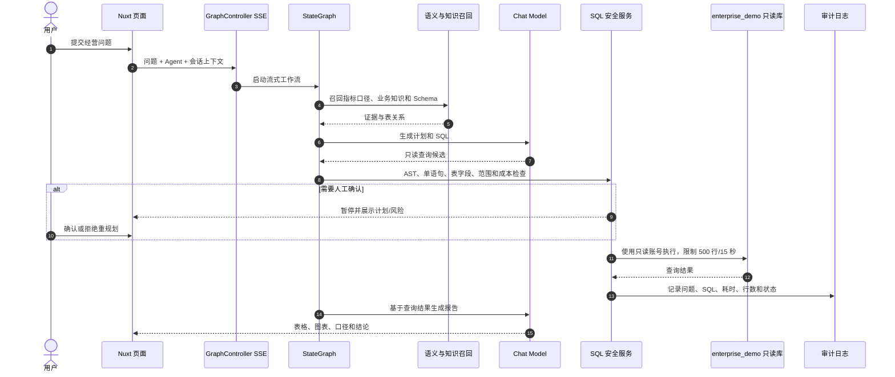

# 企业经营与财务数据分析 Agent：架构与安全设计

本文聚焦个人二次开发后的 SQL-only MVP。上游 DataAgent 的完整 Python、MCP 和多向量库能力见 [`ARCHITECTURE.md`](ARCHITECTURE.md)。

## 部署架构



管理库和合成业务库当前位于同一个 MySQL 容器中的两个逻辑数据库。Agent 查询只使用 `enterprise_agent_ro`，管理库连接使用独立的后端配置；两者不能混用。

## 业务 ER 图



金额字段统一使用 `DECIMAL(18,2)`。数据覆盖 2024-01 至 2025-12，生成器使用固定种子 `20260824`，并稳定注入销售下降、预算超支、应收缺失、长期逾期、KPI 未达标和金额不一致六类异常。

## 核心问答时序



## SQL 纵深防御

```text
模型生成 SQL
  ↓
JSqlParser AST：只允许单条 SELECT
  ↓
拒绝 DML / DDL / 存储过程 / 危险函数 / 锁 / SELECT INTO
  ↓
Agent 已绑定表白名单 + application.yml 字段白名单
  ↓
部门角色数据范围注入 + 敏感字段结果脱敏
  ↓
高成本或敏感请求进入人工确认
  ↓
JDBC 500 行上限 + 15 秒超时
  ↓
MySQL enterprise_agent_ro 仅有 enterprise_demo.* SELECT
  ↓
SQL 审计日志与 M6 攻击回归
```

任何单层都不能替代其他层。模型拒绝危险请求不是安全边界；即使模型输出写操作，也必须在应用 AST 校验和数据库授权两层被拒绝。

## 信任边界

- 外部模型：只发送回答所需的提示词、语义知识和查询上下文；不得放入真实企业数据或密钥。
- 管理页面：当前适用于可信本地演示环境，公开网络部署前必须增加身份认证、授权和管理端隔离。
- 数据库：管理账号不能作为 Agent 业务数据源；业务查询必须使用只读账号。
- 模型配置：API Key 只在本地页面录入，不进入 `.env.example`、Git、截图、评测 JSON 或日志。
- Python：默认 Compose 不挂载 Docker Socket；SQL-only 演示不启用生成代码执行。

## 可验证证据

- 12 条危险 SQL 全部被预期安全错误码阻断，2 条正常 SQL 放行。
- MySQL 只读账号可执行 `SELECT`，无法执行 `DELETE`。
- M6 36 题中两道查询因字段白名单未启用 `receivable.receivable_no` 被阻断，证明评测没有绕过安全策略。
- 完整指标和逐题证据见 [`../demo/enterprise-finance/m6/evidence/final-accepted.md`](../demo/enterprise-finance/m6/evidence/final-accepted.md)。
